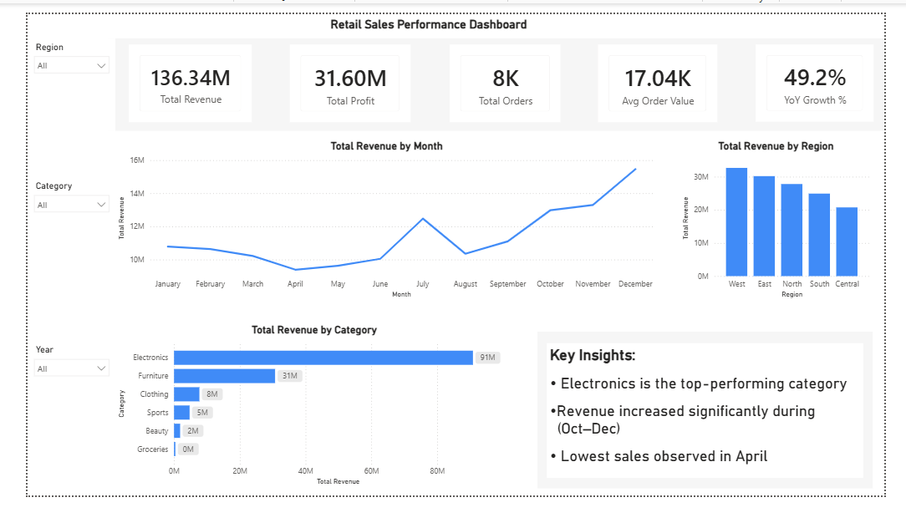
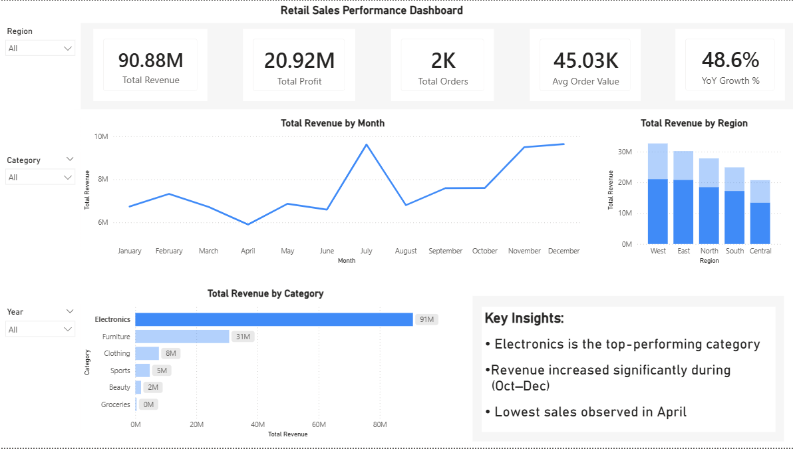
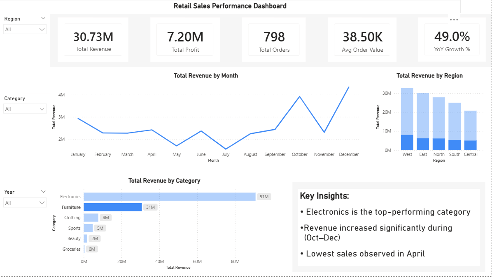

# 📊 Retail Sales Performance Dashboard — Power BI

## Overview

This project is an interactive Power BI dashboard created to analyze retail sales performance across different regions, product categories, and time periods.

The dashboard helps users quickly identify:
- Top-performing categories
- Monthly revenue trends
- Regional sales performance
- YoY growth insights
- Business KPIs

---

## Problem Statement

Retail businesses often struggle to track sales performance efficiently across multiple regions and product categories using traditional Excel reports.

This dashboard was built to provide a centralized and interactive reporting solution for monitoring sales and profitability.

---

## Features

- Interactive slicers for:
  - Region
  - Category
  - Year

- KPI Cards:
  - Total Revenue
  - Total Profit
  - Total Orders
  - Average Order Value
  - YoY Growth %

- Visualizations:
  - Revenue trend by month
  - Revenue by region
  - Revenue by category
  - Key business insights panel

---

## Tools & Technologies Used

`Power BI Desktop` `Power Query` `DAX` `Excel`

---

## Key Insights

- Electronics is the top-performing category
- Revenue increased significantly during Q4 (Oct–Dec)
- Lowest sales were observed in April
- West region generated the highest revenue

---

## Dataset

- Source: Kaggle Retail Sales Dataset
- Approx. 8,000+ retail transactions

---

## Dashboard Screenshots

### Dashboard Overview


---

## Additional Views

### Electronics Filter


### Furniture Filter


---

## Project Structure

```text
01_retail_sales_powerbi/
│
├── Retail_Sales_Dashboard.pbix
├── README.md
└── screenshots/
    ├── dashboard_overview.png
    ├── electronics_filter.png
    └── furniture_filter.png
```

---

## Author

Yogesh  
Aspiring Data Analyst | Power BI | SQL | Python